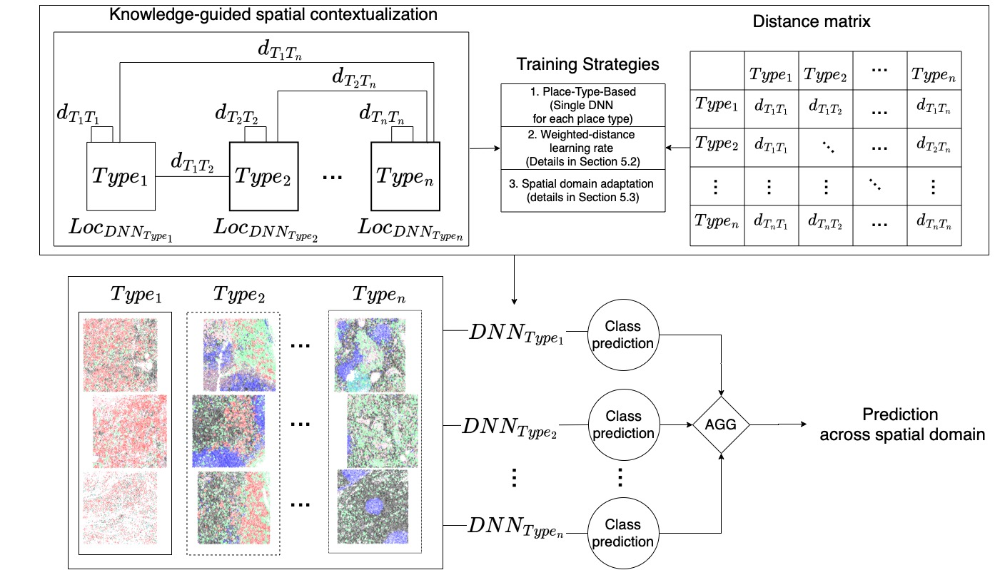

## Towards Spatially-Lucid AI Classification in Non-Euclidean Space: An Application for MxIF Oncology Data
Given multi-category point sets (e.g., cellular spatial maps) from different place-types (e.g., tumor regions), our goal is to develop a spatially-lucid classifier that can distinguish between two classes based on the arrangements of their points. This problem is important for many applications, such as oncology, for analyzing immune-tumor relationships and designing new immunotherapies. It is challenging due to spatial variability and spatial interpretability needs. Previously proposed techniques (e.g., spatial variability-aware neural networks (SVANN)) require dense training data or have limited ability to handle significant spatial variability within a single place-type. Most importantly, these deep neural network (DNN) approaches are not designed to work in non-Euclidean space, particularly point sets (e.g., point cloud and cellular spatial maps). Existing non-Euclidean DNN methods are limited to one-size-fits-all approaches. We explore a spatial ensemble framework that explicitly uses different training strategies (e.g., weighted-distance learning rate and spatial domain adaptation) on various place-types for spatially-lucid classification. Experimental results on real-world datasets (e.g., MxIF oncology data) show that the proposed framework provides higher prediction accuracy than baseline methods.
## Model architecture
This framework deploys a spatial ensemble technique involving multiple spatial models via a tailored point-wise convolution to capture relationships among different place-types, where each neural network weight is a map weight that varies across spatial domains. This entails aggregating individual model predictions through a function (e.g., weighted average, majority vote), considering the variability in spatial patterns within each distinct place-type. For example, with a distance threshold $\alpha=1$, each place-type has a separate deep neural network (DNN) trained on respective multi-category point sets. Predictions are then aggregated to determine the class label across the entire spatial domain. However, sufficient learning samples may not be available to train separate DNN classifiers. To address this, we explore alternative training strategies like weighted-distance learning rates and spatial domain adaptation, where all samples can train the target classifier (Sections \ref{wdlr}, \ref{sda}).

In this problem, we are given multi-category point sets from various place-types, where each point set is associated with one of two class labels. Additionally, we have a weighted distance matrix, denoted as $D$, where each cell represents the relative distance between two place-types $T_i$ and $T_j$, as defined by domain experts. The objective is to develop a spatially-lucid classifier algorithm that accurately separates the two class labels. Since each place-type belongs to a unique spatial domain, the location of the target deep neural network classifier is significant. This positioning is essential for selecting suitable training samples, which is determined by the distance threshold $\alpha$. It allows the model to learn spatial patterns specific to each place-type, ensuring it accommodates spatial variations and yields dependable classification results. 

## Instructions:
training model for different settings
python main.py   
    --place_type ["one-size-fits-all/OSFA, Normal, Interface, Tumor]   
    --exp_name_global "name of the global model" (if pretrained_status True)   
    --exp_name_local  "name of the local model"   
    --pretrain_status "this indicates if we use domain adaptation or no and if we already have a global model or not!"    
    --model "[pointnet, dgcnn, pointTransformers, samcnet]", which neural network architecture to be used"   
    --weighted_distance "if we use weighted-distance learning rate (adjust learning rate based on the location of target model)"   
    --use_pe "if we use positional encoding for samcnet and pointtransformers   
    --batch_size "the size of training batch"   
    --test_batch_size "the size of testing batch"   
    --epochs_global "number of epochs needed to train a global model"   
    --epochs_local "number of epochs needed to train a local model, or #epochs to train a place-type-based model from scratch   
    --radius neighrbodhood distance to create a locally-connected-graph   
    --num_neighbors "how many neighbors to be selected for KNN"   
    --use_sgd "if to use stochastic gradient descent"    
    --lr "learning rate: initial one 0.001"   
    --momentum "momentum  default=0.9"    
    --no_cuda "if to use GPU or not"   
    --num_points "size of point set"   
    --num_heads "number of attention heads for samcnet, Pointnet has a similar parameters that is assigned locally"   
    --dropout "dropout parameter for remaining layers"   
    --emb_dims "number of dimension of embeddings"    
    --PE_dim "output dimension of positional encoding (if use_pe false) this should be 3"   
    --num_frozen_layers "If there's a pre-trained model, how many layers should be frozen for fine-tuning"   
    --train_res_global "save training results for global model"   
    --train_res_local "save training results for local model"   
    --test_res_local "save testing results for local model"   
    --local_learner_path "the path to local model to be fine-tuned for target place-type"   

## Hyperparameters:

| Parameters | Normal (PT 1) | Interface (PT 2) | Tumor (PT 3)|
|---------|---------|---------|---------|
| Epoch global| 150| 150|150|
| Epoch local| 50| 50| 50|
| batch size| 16| 16| 16|
| learning rate| 0.001| 0.001| 0.001|
| momentum| 0.9| 0.9| 0.9|
| num\_points| 1024| 1024| 1024|
| dropout| 0.5| 0.5| 0.5|
| num\_neighbors| 5| 7| 5|
| neighborhood distance (radius)| 75| 100| 75|
| min\_grid\_scale| 1| 1| 1|
| max\_grid\_scale | 100| 100| 100|
|grid\_scale\_count| 5| 5| 5|

num_frozen_layers: choices=['pointnet, num_frozen_layers=3',  'dgcnn, num_frozen_layers = 3', 'pointTransformers',  num_frozen_layers = 9' 'samcnet',  num_frozen_layers = 4']

## Acknowledgement
The structure of this codebase is borrowed from [DGCNN](https://github.com/WangYueFt/dgcnn) and [SAMCNet](https://github.com/majid-farhadloo/SAMCNet_2022)
