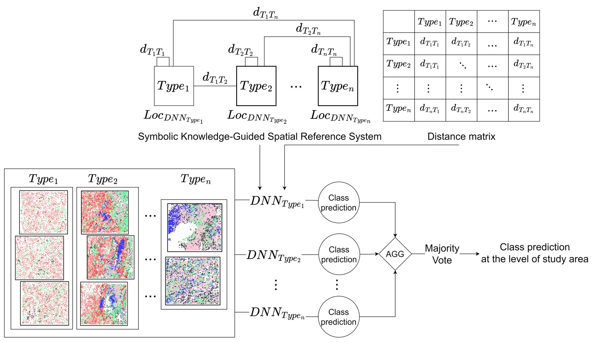

## SVANN-Bio: Spatial-Variability Aware Neural Networks for Biomedical Spaces
Given bio-medical maps from different place types, the goal is to learn a spatially-explainable classifier to distinguish between two classes. This problem is important for several applications, such as generating hypotheses for designing new immune therapies for cancer treatment. The problem is challenging due to non-rigidity, spatial variability, and the need for spatial explainability. Previously proposed techniques (e.g., Spatial variability-aware neural networks (SVANN)) were able to better model spatial variability than traditional one-size-fits-all (OSFA) approaches in geographical spaces. However, SVANN and similar approaches do not work for non-rigid biomedical spaces. To overcome these limitations, we propose SVANN-Bio which uses knowledge-guided symbolic spatial-referencing to address the absence of a spatial reference system for non-rigid spaces. Experimental results on real-world datasets (e.g., cancer) show that the proposed model provides higher prediction accuracy over baseline methods.
## Model architecture
We introduce SVANN-Bio, a spatial-variability aware neural network for bio-medical spaces, to effectively distinguish between maps belonging to distinct spatial domains. SVANN-Bio employs a symbolic knowledge-guided spatial reference approach to select appropriate model locations due to the lack of a spatial coordinate system in non-rigid spaces. The term ``symbolic'' refers to the spatial characterization of different place types defined by domain experts. ``Knowledge-guided'' refers to the relative distance between these place types, which are used as inputs to the deep learning model during the training process based on the location of the model neural network. Similarly, the relative distances are also often defined by domain experts in related applications.

## Author's Implementations

The classification experiments in our paper are done with the pytorch implementation.

## Acknowledgement
The structure of this codebase is borrowed from [DGCNN](https://github.com/WangYueFt/dgcnn) and [SAMCNet](https://github.com/majid-farhadloo/SAMCNet_2022)
